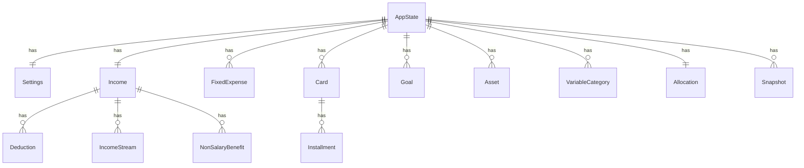

# Data Model: Personal Finance Dashboard

> Plan: [2-plan.md](./2-plan.md) · Spec: [1-spec.md](./1-spec.md)
> Schema version: **v2**
> Persistence: `localStorage` key `finance_app_data`

## Overview

Single persisted object validated by Zod at the storage boundary (`lib/storage/schema.ts`). All entity IDs use `crypto.randomUUID()`. The schema is versioned; migrations live in `lib/storage/migrate.ts` as a chain (`migrations[2]` runs when an existing v1 payload is detected on boot).

## Entity diagram (Mermaid)



## Zod schema (target shape of `lib/storage/schema.ts`)

> The TypeScript types below are inferred from these schemas via `z.infer<typeof Schema>`. They are illustrative — the actual types live next to the schema and are consumed by stores and composables.

```ts
// ---------- Primitives ----------
const ID = z.string().uuid()
const Money = z.number().nonnegative().finite()
const Percent01 = z.number().min(0).max(100)
const ISODateString = z.string().regex(/^\d{4}-\d{2}-\d{2}$/)
const ISODateTimeString = z.string().datetime()
const YearMonth = z.string().regex(/^\d{4}-\d{2}$/) // "2026-05"
const CurrencyCode = z.enum(['COP', 'USD', 'CLP', 'MXN', 'ARS', 'BRL', 'PEN'])
const Lang = z.enum(['es', 'en'])
const Theme = z.enum(['light', 'dark', 'system'])

// ---------- Settings ----------
const SettingsSchema = z.object({
  lang: Lang.default('es'),
  currency: CurrencyCode.default('COP'),
  theme: Theme.default('system'),
  payoffMethod: z.enum(['avalanche', 'snowball']).default('avalanche'),
  onboarding: z
    .object({
      done: z.boolean().default(false),
      currentStep: z.number().int().min(0).max(3).default(0), // 0..3 (3 = finished)
    })
    .default({ done: false, currentStep: 0 }),
  lastMonthSeen: YearMonth.nullable().default(null), // for AC-13.1 detection
})

// ---------- Income ----------
const DeductionTypeEnum = z.enum(['fixed', 'percent'])
const DeductionSchema = z.object({
  id: ID,
  label: z.string().min(1).max(60),
  amount: z.number().min(0).finite(), // amount or percentage value depending on type
  type: DeductionTypeEnum,
})

const FrequencyEnum = z.enum(['monthly', 'quarterly', 'semiannual', 'annual'])
const IncomeStreamSchema = z.object({
  id: ID,
  label: z.string().min(1).max(60),
  amount: Money,
  frequency: FrequencyEnum.default('monthly'),
})

const NonSalaryBenefitSchema = z.object({
  id: ID,
  label: z.string().min(1).max(60),
  amount: Money,
})

const IncomeSchema = z.object({
  grossSalary: Money.default(0),
  deductions: z.array(DeductionSchema).default([]),
  otherStreams: z.array(IncomeStreamSchema).default([]),
  nonSalaryBenefits: z.array(NonSalaryBenefitSchema).default([]),
})

// ---------- Fixed expenses ----------
const ExpenseCategoryEnum = z.enum([
  'housing',
  'utilities',
  'transport',
  'food',
  'health',
  'education',
  'subscriptions',
  'insurance',
  'other',
])

const FixedExpenseSchema = z.object({
  id: ID,
  name: z.string().min(1).max(60),
  amount: Money,
  category: ExpenseCategoryEnum,
})

// ---------- Cards / Loans ----------
const InstallmentSchema = z.object({
  id: ID,
  name: z.string().min(1).max(60),
  total: Money, // total purchase amount
  installments: z.number().int().min(1).max(72), // total number of installments
  paid: z.number().int().min(0).default(0), // installments already paid
})

const CardTypeEnum = z.enum(['card', 'loan'])

// Card discriminated union by `type` for stronger types in TS:
const CardCommonSchema = z.object({
  id: ID,
  name: z.string().min(1).max(60),
  limit: Money.optional(), // only meaningful for `card`
  balance: Money,
  minPayment: Money.default(0),
  apr: z.number().min(0).max(200).finite(), // EA %
  installmentsList: z.array(InstallmentSchema).default([]),
})

const CardSchema = z.discriminatedUnion('type', [
  CardCommonSchema.extend({
    type: z.literal('card'),
    dueDate: z.number().int().min(1).max(31), // day of month
  }),
  CardCommonSchema.extend({
    type: z.literal('loan'),
    remainingInstallments: z.number().int().min(0).max(360),
  }),
])

// ---------- Goals ----------
const GoalPrioritySchema = z.number().int().min(0).default(0) // sort order

const GoalSchema = z.object({
  id: ID,
  name: z.string().min(1).max(60),
  target: Money,
  saved: Money.default(0),
  monthlyContrib: Money.default(0),
  targetDate: ISODateString.nullable().default(null),
  priority: GoalPrioritySchema,
})

// ---------- Assets ----------
const AssetTypeEnum = z.enum(['cash', 'savings', 'investment', 'property', 'vehicle', 'other'])

const AssetSchema = z.object({
  id: ID,
  name: z.string().min(1).max(60),
  value: Money,
  type: AssetTypeEnum,
})

// ---------- Variable expenses ----------
const VariableCategorySchema = z.object({
  id: ID,
  name: z.string().min(1).max(60),
  icon: z.string().min(1).max(40), // lucide icon name or emoji
  budget: Money,
  spent: Money.default(0),
})

// ---------- Allocation (50/30/20 style) ----------
const AllocationSchema = z
  .object({
    needs: Percent01.default(50),
    wants: Percent01.default(30),
    savings: Percent01.default(20),
  })
  .refine((a) => a.needs + a.wants + a.savings === 100, { message: 'allocation.sumMustBe100' })

// ---------- Snapshots (US-13) ----------
const SnapshotSchema = z.object({
  id: ID,
  month: YearMonth, // "2026-04"
  capturedAt: ISODateTimeString,
  netIncome: Money,
  totalFixedExpenses: Money,
  totalVariableSpent: Money,
  totalDebt: Money,
  dti: z.number().min(0).max(1000).finite(), // percent
  savingsRate: z.number().finite(), // percent, can be negative
  netWorth: z.number().finite(), // can be negative
  healthScore: z.number().min(0).max(100).nullable(),
})

// ---------- Root ----------
const AppStateSchemaV2 = z.object({
  schemaVersion: z.literal(2),
  settings: SettingsSchema,
  income: IncomeSchema,
  expenses: z.array(FixedExpenseSchema).default([]),
  cards: z.array(CardSchema).default([]),
  goals: z.array(GoalSchema).default([]),
  assets: z.array(AssetSchema).default([]),
  variableExpenses: z.array(VariableCategorySchema).default([]),
  allocation: AllocationSchema,
  snapshots: z.array(SnapshotSchema).default([]),
})

export type AppState = z.infer<typeof AppStateSchemaV2>
```

## Persistence rules

- **Single key:** `finance_app_data` in `localStorage`. Same key as v1 to enable in-place migration.
- **Backup on migration:** First successful v1 → v2 migration writes the original v1 payload to `finance_app_data_v1_backup` (one-shot; never overwritten).
- **Write trigger:** Debounced watcher (300 ms) in `lib/storage/useAppStorage.ts` aggregating all Pinia stores, identical to v1's debounce.
- **Quota handling (EC-6):** `JSON.stringify` + `localStorage.setItem` wrapped in try/catch. On `QuotaExceededError`, a non-blocking toast surfaces and in-memory state is preserved; no data written.
- **Snapshot cap:** Snapshots array is sorted by `month` descending; on write, entries beyond the most recent 24 are dropped (FIFO). Documented to the user in the History view footer.
- **Validation:** `AppStateSchemaV2.safeParse(parsed)` runs on every read. On parse failure (corrupted data), a one-shot recovery flow surfaces an error and offers to restore from `finance_app_data_v1_backup` or reset; current behavior is **never silently overwrite** corrupted data.

## Migration from v1 (vanilla SPA shape)

v1 shape (current, from `app.js` `state`):

```ts
{
  schemaVersion: 1,
  lang: 'es' | 'en',
  currency: 'COP' | ...,
  income: { grossSalary, deductions[], otherStreams[] },
  expenses: [{ id, name, amount, category, notes }],
  cards: [{ id, name, limit, balance, minPayment, apr, dueDate, installments[] }],
  goals: [{ id, name, target, saved, monthlyContrib, targetDate, priority }],
  assets: [{ id, name, value, type }],
  variableExpenses: [{ id, name, budget, spent, categoryId }],
  budgetAllocation: { needs, wants, savings },
  payoffMethod: 'avalanche' | 'snowball',
}
```

### `migrations[2]: (v1: V1State) => V2State`

| v1 field                                                                      | v2 field                      | Transform                                                                                                   |
| ----------------------------------------------------------------------------- | ----------------------------- | ----------------------------------------------------------------------------------------------------------- |
| `lang`                                                                        | `settings.lang`               | move                                                                                                        |
| `currency`                                                                    | `settings.currency`           | move                                                                                                        |
| (none)                                                                        | `settings.theme`              | default `'system'`                                                                                          |
| `payoffMethod`                                                                | `settings.payoffMethod`       | move                                                                                                        |
| (none)                                                                        | `settings.onboarding`         | `{ done: hasAnyData(v1), currentStep: 3 }` — existing users skip the wizard                                 |
| (none)                                                                        | `settings.lastMonthSeen`      | current `YYYY-MM` — prevents a spurious snapshot for "last month" on first v2 boot                          |
| `income.grossSalary`                                                          | `income.grossSalary`          | move                                                                                                        |
| `income.deductions`                                                           | `income.deductions`           | move; verify `type` ∈ `{fixed, percent}`                                                                    |
| `income.otherStreams[]`                                                       | `income.otherStreams[]`       | move; **set `frequency = 'monthly'`** for every v1 entry (v1 had no frequency field)                        |
| (none)                                                                        | `income.nonSalaryBenefits`    | `[]` — new in v2                                                                                            |
| `expenses[].notes`                                                            | dropped                       | per US-4 decision: notes field removed                                                                      |
| `expenses[]` (without notes)                                                  | `expenses[]`                  | move; map category strings to `ExpenseCategoryEnum` (fallback `'other'`)                                    |
| `cards[]` (with `dueDate`)                                                    | `cards[]` with `type: 'card'` | move + add discriminator                                                                                    |
| `cards[]` representing loans (heuristic: missing `dueDate` or marked as loan) | `cards[]` with `type: 'loan'` | move + add discriminator; if `remainingInstallments` not derivable, default to `0` and flag for user review |
| `cards[].installments[]`                                                      | `cards[].installmentsList[]`  | rename to avoid collision with the `installments` count field; ensure `paid` defaults to `0`                |
| `goals[]`                                                                     | `goals[]`                     | move; preserve `priority` order                                                                             |
| `assets[]`                                                                    | `assets[]`                    | move; map `type` to `AssetTypeEnum` (fallback `'other'`)                                                    |
| `variableExpenses[].categoryId`                                               | dropped                       | v2 categories are top-level entities; no second-level category                                              |
| `variableExpenses[]` (rest)                                                   | `variableExpenses[]`          | move; add `icon: 'circle'` if missing                                                                       |
| `budgetAllocation`                                                            | `allocation`                  | rename; clamp to sum=100 (else default 50/30/20)                                                            |
| (none)                                                                        | `snapshots`                   | `[]`                                                                                                        |
| `schemaVersion: 1`                                                            | `schemaVersion: 2`            | set                                                                                                         |

### Migration tests

- `tests/unit/storage/migrate-v1-to-v2.test.ts`
- Fixtures: `tests/fixtures/v1-empty.json`, `v1-typical.json`, `v1-with-loans.json`, `v1-corrupt-allocation.json`
- Each fixture is migrated, then validated by `AppStateSchemaV2.parse` — any throw is a failing test.

## Field-by-field constraints (highlights)

- **Money:** `z.number().nonnegative().finite()` — `Infinity`/`NaN` rejected; negatives only on derived values (`netWorth`, `savingsRate`).
- **Percent01:** `0 ≤ x ≤ 100`.
- **ID:** v4 UUID. v1 IDs that are not UUID-shaped are regenerated during migration; cross-references (none currently) would be remapped, but v1 has none.
- **APR:** `0 ≤ apr ≤ 200` to allow extreme but real Latin-American card rates; EC-10 (APR = 0) is handled in `lib/calculations/amortization.ts`.
- **Allocation:** Refinement enforces `needs + wants + savings === 100`. AC-14.1 auto-derives `savings` so the schema is never written with an invalid sum from the UI.
- **YearMonth (snapshots):** `"YYYY-MM"`. Comparison is string-lexicographic.

## Forward compatibility

- Adding a new persisted field requires: (1) add to `AppStateSchemaV2` (or bump to `V3` if breaking), (2) add `migrations[N]` if breaking, (3) bump `schemaVersion`, (4) add migration test fixture, (5) update this file. This is the constitution's "Adding a persisted field without updating `migrate()` is forbidden" rule, made explicit.
